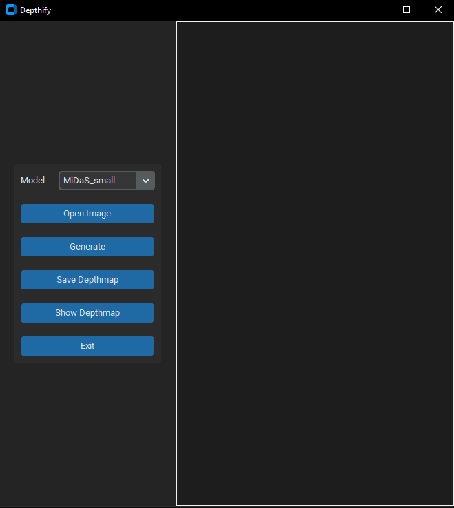

# Depthify - Depth Map Generator

Depthify is an open-source project that utilizes the power of the MiDaS (Monocular Depth Estimation) model to generate high-quality depth maps from 2D images.

## Key Features

- **MiDaS Model Integration:** Depthify leverages the state-of-the-art MiDaS model for real-time depth estimation, ensuring impressive accuracy and quality in the generated depth maps.

## Getting Started

Follow the instructions below to set up Depthify and start generating depth maps:

1. **Installation:**
   - Clone this repository: `git clone https://github.com/noob-guy-dev/Depthify.git`
   - The end 

2. **Usage:**
   - To run simply double click "MiDaS.bat".
   - All the requirements will be automatically installed and program will be started.

## Acknowledgments

- MiDaS Model: [Link to MiDaS GitHub Repository](https://github.com/isl-org/MiDaS)

